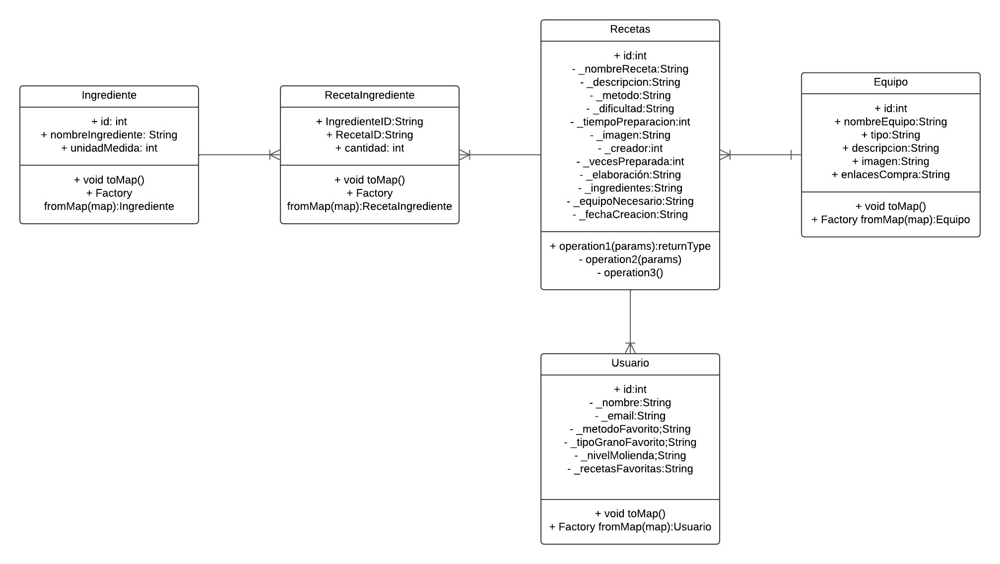

# Coffee Quest

Un nuevo proyecto de Flutter para explorar y compartir recetas de café.

**Link a presentación**
https://www.youtube.com/watch?v=KxvuP4FybVc&t=1s

## Tabla de Contenidos

1. [Descripción del Proyecto](#descripción-del-proyecto)
2. [Instalación](#instalación)
3. [Uso](#uso)
4. [Requerimientos](#requerimientos)
   - [Requerimientos Funcionales](#requerimientos-funcionales)
   - [Requerimientos No Funcionales](#requerimientos-no-funcionales)
5. [Recursos Adicionales](#recursos-adicionales)
6. [Documentación](#documentación)

---

## Descripción del Proyecto

**Coffee Quest** es una aplicación móvil desarrollada en Flutter que permite a los usuarios descubrir, crear y compartir recetas de café. La aplicación está diseñada para aficionados y baristas que buscan ampliar sus conocimientos sobre técnicas de preparación y experimentar con nuevos sabores.

---

## Instalación

Para instalar y ejecutar este proyecto localmente:

[Descargar APK](CoffeeQuest.apk)

---

## Uso

1. Al abrir la aplicación, encontrarás una lista de recetas de café disponibles.
2. Navega por las distintas recetas, personalízalas según tus preferencias y guarda tus favoritas.
3. Comparte tus creaciones con otros usuarios.

---

## Diagramas

### Modelo relacional de referencia
Se diseño el siguiente modelo relacional para comprender mejor como se comportaría la base de datos en un entorno relacional dado el uso de una tabla intermedia en el proyecto, sirvió más que nada como orientación.

### Diagrama de navegación
En el siguiente diagrama se presenta la navegación entre las diferentes pantallas de la aplicación.

### Diagrama de flujo de creación de recetas
En el siguiente diagrama se presenta el flujo que debe realizar el usuario para crear una receta dentro de la aplicación.

---

## Requerimientos

### Requerimientos Funcionales

1. **Gestión de Recetas de Café:**
   - RF1.1: El usuario debe poder ver una lista de recetas de café disponibles en la aplicación.
   - RF1.2: El usuario debe poder personalizar las recetas, ajustando parámetros como el tipo de grano, tiempo de extracción y cantidad de agua.
   - RF1.3: El usuario debe poder guardar recetas personalizadas en una lista de favoritas.
   - RF1.4: El usuario debe poder compartir sus recetas a través de la aplicación con otros usuarios.

2. **Guías de Preparación:**
   - RF2.1: La aplicación debe ofrecer guías paso a paso para diferentes tipos de café.
   - RF2.2: Cada guía debe poder ser personalizada según las preferencias del usuario.

3. **Personalización del Usuario:**
   - RF3.1: El usuario debe poder crear un perfil donde especifique sus preferencias personales (técnica de extracción favorita, nivel de molienda, tipo de grano preferido).
   - RF3.2: Las preferencias del usuario deben influir en las recetas y guías sugeridas dentro de la aplicación.
   - RF3.3: El usuario debe poder actualizar su perfil en cualquier momento.

### Requerimientos No Funcionales

1. **Compatibilidad Multiplataforma:**
   - RNF1.1: La aplicación debe estar disponible para dispositivos móviles, tabletas y computadoras de escritorio.
   - RNF1.2: La interfaz debe adaptarse automáticamente al tamaño de la pantalla del dispositivo.

2. **Rendimiento:**
   - RNF2.1: La aplicación debe cargarse en menos de 3 segundos al iniciar.
   - RNF2.2: Las transiciones entre pantallas y la navegación deben ser fluidas y sin interrupciones.

3. **Seguridad:**
   - RNF3.1: La aplicación debe garantizar la privacidad de los datos del usuario, almacenando sus preferencias y recetas de manera segura.

4. **Escalabilidad:**
   - RNF4.1: La aplicación debe poder gestionar grandes cantidades de usuarios y recetas sin afectar el rendimiento.

---

## Recursos Adicionales

- [Lab: Write your first Flutter app](https://docs.flutter.dev/get-started/codelab)
- [Cookbook: Useful Flutter samples](https://docs.flutter.dev/cookbook)

---

## Documentación

Para obtener más información sobre Flutter, visita la [documentación en línea](https://docs.flutter.dev/), donde encontrarás tutoriales, ejemplos y referencias de API.
